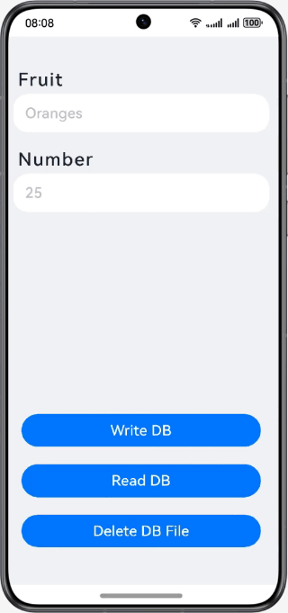

# 首选项

### 简介

基于首选项，实现对本地应用数据的访问及操作。效果图如下：

### 相关概念

- 用户首选项：首选项为应用提供Key-Value键值型的数据处理能力，支持应用持久化轻量级数据，并对其修改和查询。数据存储形式为键值对，键的类型为字符串型，值的存储数据类型包括数字型、字符型、布尔型以及这3种类型的数组类型。
- TextInput：单行文本输入框组件。
- Button：按钮组件，可快速创建不同样式的按钮。

### 相关权限

不涉及

### 使用说明

1. 在Fruit和Number文本输入框中，输入对应的水果名称和水果数量，点击**Write DB**按钮，将输入的数据保存到首选项中。
2. 退出应用再重新进入，在Fruit和Number文本输入框中对应显示上一次保存的数据。
3. 点击**Read DB**按钮，在Fruit和Number文本输入框中对应显示上一次保存的数据。
4. 点击**Delete DB File**按钮，Fruit和Number文本输入框中的数据清空，并删除首选项中的数据及对应的数据库文件。

### 约束与限制

1. 本示例仅支持标准系统上运行，支持设备：华为手机。
2. HarmonyOS系统：HarmonyOS NEXT Developer Beta1及以上。
3. DevEco Studio版本：DevEco Studio NEXT Developer Beta1及以上。
4. HarmonyOS SDK版本：HarmonyOS NEXT Developer Beta1 SDK及以上。
