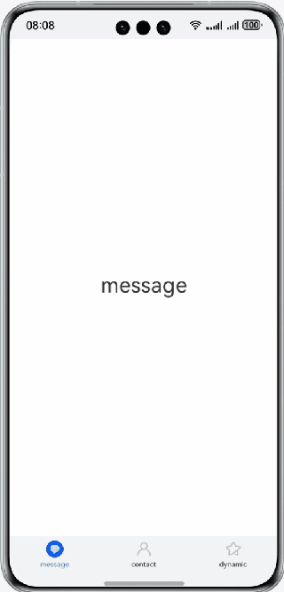
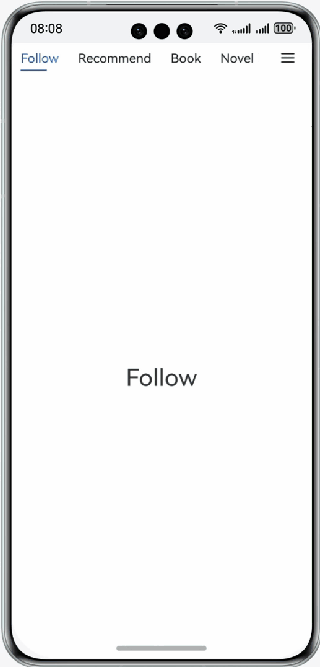
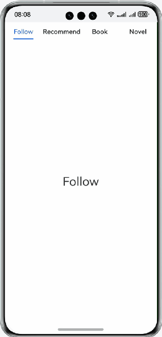
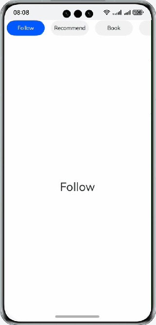
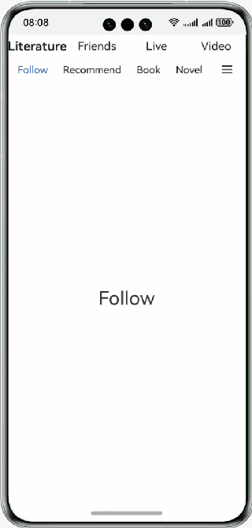
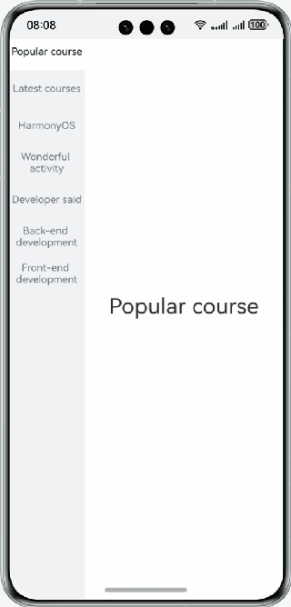
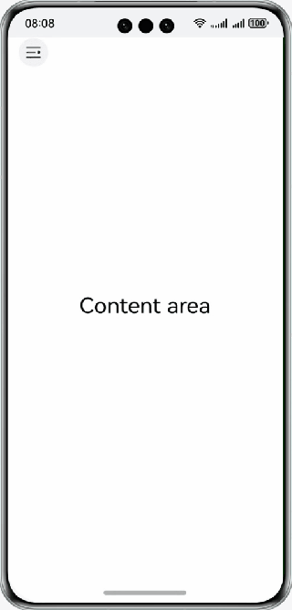

# Common Tab Navigation Styles

### Overview

This sample provides common tab navigation UI styles, including bottom navigation, top navigation, and side navigation.

### Preview
| Bottom navigation                             | Bottom rubber navigation                      | TabContent video sliding                       | Sliding + More button style                 |                         
|-----------------------------------------------|-----------------------------------------------|------------------------------------------------|---------------------------------------------|
|     |     |  |   |      
| Underline                                     | Background highlight                          | Text                                           | Double-layer nesting 1                      |
|  |  |     |  |
| Side navigation                        | Drawer-style side navigation                              | Left-aligned style navigation                  |
|   |       |     |

### How to Use
1. Tap a tab on the home page to go to the corresponding page.
2. Tap a tab on the navigation page to switch between pages.
3. Tap the icon in the upper left corner to expand or collapse the drawer navigation.

### Project Directory

```
├──entry/src/main/ets/
│  ├──common
│  │  └──Constants.ets                  // Common constants
│  │  ├──TabContentConstants.ets        // TabContentOverflow constant class
│  │  └──Utils                          // Common basic class library
│  ├──entryability
│  │  └──EntryAbility.ets               // Entry point class
│  ├──pages                 
│  │  ├──BackgroundLightTab.ets         // Background highlight
│  │  ├──BottomTab.ets                  // Bottom navigation
│  │  ├──DoubleNestingTabOne.ets        // Double-layer nesting implementation 1
│  │  ├──DoubleNestingTabTwo.ets        // Double-layer nesting implementation 2
│  │  ├──DrawerTab.ets                  // Drawer-style navigation
│  │  ├──Index.ets                      // Drawer-style side navigation
│  │  ├──LeftTab.ets                    // Left-aligned style navigation 
│  │  ├──RudderStyleTab.ets             // Bottom rudder navigation
│  │  ├──SideTab.ets                    // Side navigation
│  │  ├──SlideAndMoreTab.ets            // Slideable + More styles
│  │  ├──TabContentOverflow.ets         // TabContent video content sliding
│  │  ├──UnderlineTab.ets               // Underline
│  │  └──WordTab.ets                    // Text
│  ├──view                 
│  │  ├──Side.ets                       // Sidebar of TabContent video sliding
│  │  ├──TopView.ets                    // Topbar of TabContent video sliding
│  │  ├──VideoDes.ets                   // TabContent video content description
│  │  └──VideoTabContent.ets            // TabContent video content
│  │  └──DiscoverPage.ets               // DoubleNesting content
│  └──viewmodel                  
│     ├──TabItem.ets                    // Navigation class
│     └──TabViewModel.ets               // Navigation data
└──entry/src/main/resources             // Static resources of the app
```

### How to Implement

1. The common bottom navigation is implemented by the **Tab** component.
2. Two-layer nesting style: The first layer uses the **Tab** component, and the second layer uses the **List** component.
3. Slidable + More: This navigation style is implemented using the **List** component on the left. More icons are displayed on the right. You can set the **margin** value for the underline and modify the value through the **onAreaChange** method to move the slider. The **scrollToIndex** method is used to display and center the tab bar during switching.
4. The background highlight style and common sidebar navigation are implemented using the **List** component.
5. The drawer-style navigation is implemented by using **SideBarContainer**.
6. TabContent video sliding: Create a **Tabs** component and set **barHeight** to **0**. Create a customized tab bar. Divide the content of TabContent into two parts: the upper part stores the **video** component and the lower part stores the progress bar. Set the sliding gesture response event. Set the **zIndex** attribute of the **Tabs** component to **2** so that the TabContent view displayed over the customized tab bar. Then set the **hitTestBehavior** attribute to enable the covered customized tab bar to respond to a tap event.

### Required Permissions
N/A

### Dependencies
N/A

### Constraints

1. The sample is supported only on Huawei phones with standard systems.

2. The HarmonyOS version must be HarmonyOS NEXT Developer Beta 3 or later.

3. The DevEco Studio version must be DevEco Studio NEXT Developer Beta 3 or later.

4. The HarmonyOS SDK version must be HarmonyOS NEXT Developer Beta 3 or later.
