# 常见Tab导航样式合集

### 介绍

本示例为开发者提供常见的Tab导航的UI样式，包括底部导航，顶部导航，侧边导航等典型场景。

### 效果预览
| 常见底部导航                                     | 舵式底部导航                                     | TabContent视频内容滑动                            | 可滑动+更多按钮样式                                |                         
|--------------------------------------------|--------------------------------------------|---------------------------------------------|-------------------------------------------|
| 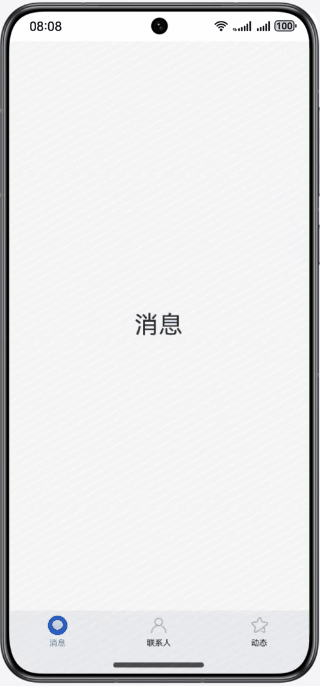    | 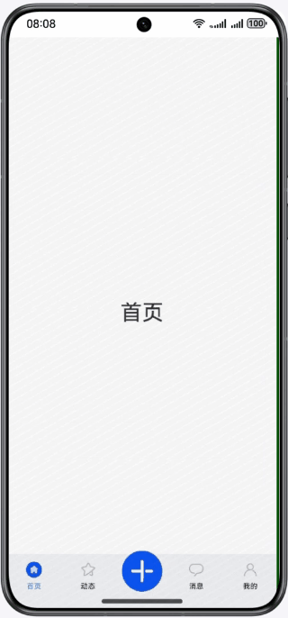    |  | 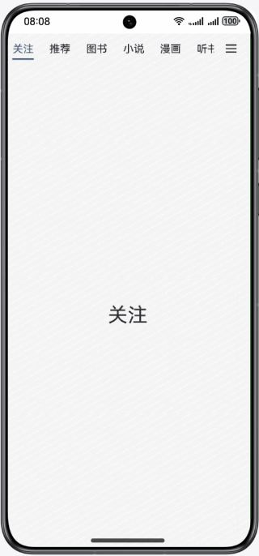   |      
| 下划线样式                                      | 背景高亮样式                                     | 文字样式                                        | 双层嵌套样式 1                                  |
| 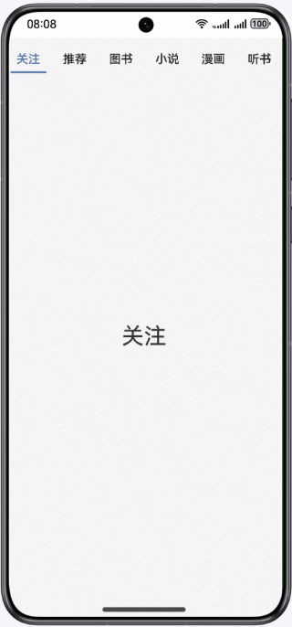 | 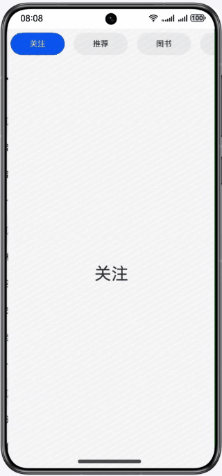 | 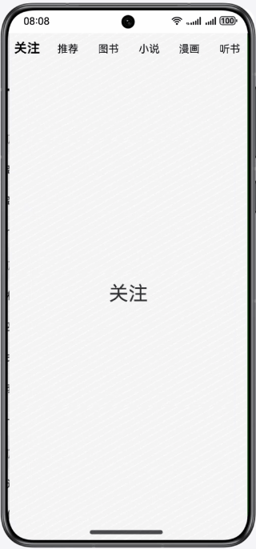    | 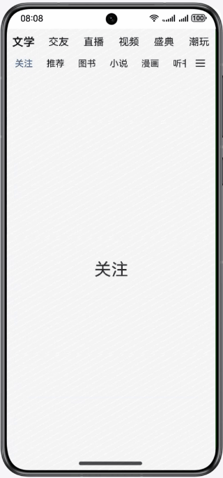 |
| 双层嵌套样式 2                                   | 常见侧边导航                                     | 抽屉式侧边导航                                    | 居左对齐样式
| 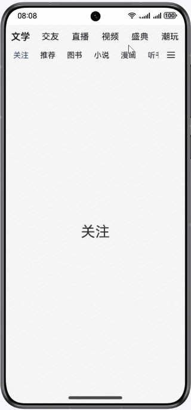  | 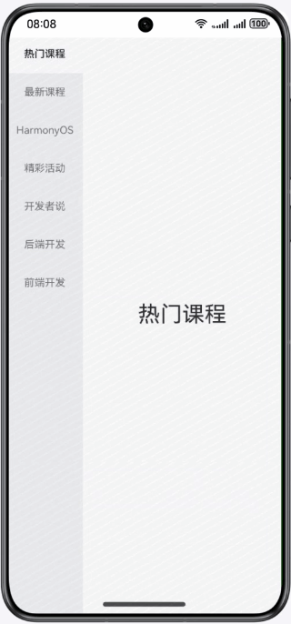      | 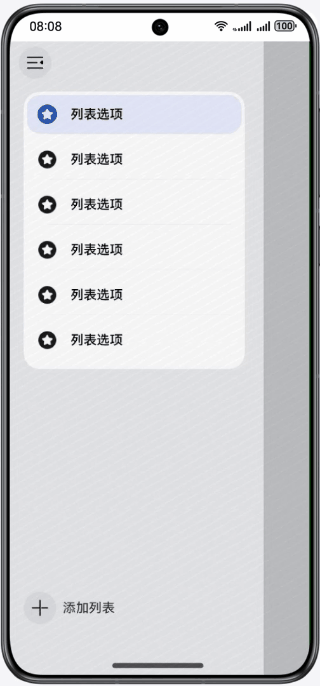   |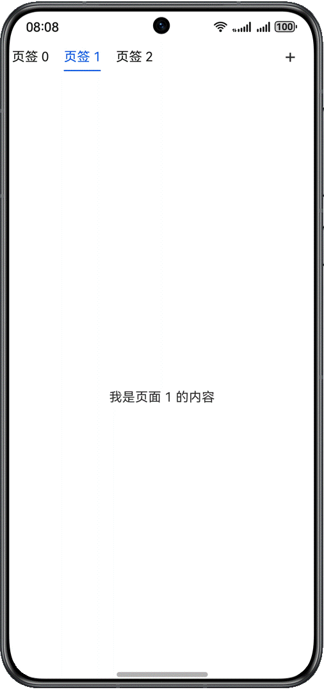
使用说明：
1. 首页点击各个标签跳转到对应Tab页面。
2. 导航页点击Tab标签实现页面切换。
3. 抽屉式导航点击左上角图标实现展开折叠。

### 工程目录

```
├──entry/src/main/ets/
│  ├──common
│  │  ├──Constants.ets                  // 公共常量类
│  │  ├──TabContentConstants.ets        // TabContentOverflow常量类
│  │  └──Utils                          // 公共基础类库
│  ├──entryability
│  │  └──EntryAbility.ets               // 程序入口类
│  ├──pages                 
│  │  ├──BackgroundLightTab.ets         // 背景高亮样式
│  │  ├──BottomTab.ets                  // 常见底部导航
│  │  ├──DoubleNestingTabOne.ets        // 双层嵌套样式实现1
│  │  ├──DoubleNestingTabTwo.ets        // 双层嵌套样式实现2
│  │  ├──DrawerTab.ets                  // 抽屉式导航
│  │  ├──Index.ets                      // 抽屉式侧边导航
│  │  ├──LeftTab.ets                    // 居左对齐导航
│  │  ├──RudderStyleTab.ets             // 舵式底部导航
│  │  ├──SideTab.ets                    // 常规侧边导航
│  │  ├──SlideAndMoreTab.ets            // 可滑动+更多样式
│  │  ├──TabContentOverflow.ets         // TabContent视频内容滑动并在Tabbar上显示
│  │  ├──UnderlineTab.ets               // 下划线样式
│  │  └──WordTab.ets                    // 文字样式
│  ├──view                 
│  │  ├──Side.ets                       // TabContent视频内容滑动侧边栏
│  │  ├──TopView.ets                    // TabContent视频内容滑动顶部栏
│  │  ├──VideoDes.ets                   // TabContent视频内容描述
│  │  └──VideoTabContent.ets            // TabContent视频内容
│  │  └──DiscoverPage.ets               // DoubleNesting嵌套内容
│  └──viewmodel                  
│     ├──TabItem.ets                    // 导航类
│     └──TabViewModel.ets               // 导航数据
└──entry/src/main/resources             // 应用静态资源目录
```

### 具体实现

1. 常规型底部导航用Tab组件实现。
2. 双层嵌套样式：第一层用Tab组件，第二层用List实现嵌套。
3. 可滑动+更多左侧用List实现，右侧为更多图标，下滑线设置margin值并在onAreaChange方法中改变margin值可实现移动， scrollToIndex实现切换时Tab栏显示并居中。
4. 背景高亮样式和常见侧边导航用List实现。
5. 抽屉式导航用SideBarContainer实现。
6. TabContent视频内容滑动：创建Tabs组件，将barHeight设置为0；创建自定义TabBar；将TabContent的内容分为上下两部分，上半部存放video组件，下部分高度存放进度条，设置滑动手势响应事件；将Tabs组件的zIndex 属性设置为2，TabContent的视图就可以堆叠在自定义TabBar之上；再设置hitTestBehavior属性使被覆盖的自定义的TabBar可以响应点击事件。

### 相关权限
不涉及

### 依赖
不涉及

### 约束与限制

1.本示例仅支持标准系统上运行，支持设备：华为手机。 

2.HarmonyOS系统：HarmonyOS NEXT Release及以上。

3.DevEco Studio版本：DevEco Studio NEXT Release及以上。

4.HarmonyOS SDK版本：HarmonyOS NEXT Release SDK及以上。